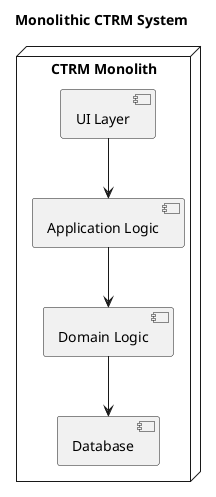
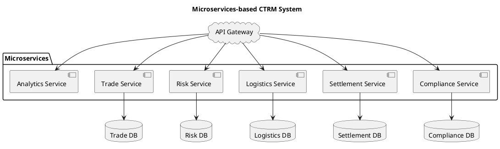
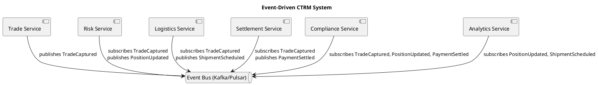

# Architecture alternatives

IT systems commonly called **CTRM / ETRM systems** have to balance **real-time trading needs**, **risk calculations**, **logistics complexity**, and **regulatory compliance**.

Several architectural alternatives exist, each with trade-offs.

## Monolithic Application (Traditional CTRM)

🔹 *Example*: Endur, Allegro, TriplePoint (older generation).

**Characteristics**:

  * One large codebase with all modules (trade capture, risk, logistics, settlement).
  * Tight coupling between front, middle, and back office.
  * Often built on relational DB + heavy customization.

**Pros**:

  * Strong transactional integrity (ACID).
  * Easier to implement at small scale.
  * One-stop-shop (all functionality in one place).

**Cons**:

  * Hard to scale horizontally.
  * Expensive to customize, upgrade, and maintain.
  * Risk of vendor lock-in.

**When to use**: Smaller firms, or when a stable, standardized product is enough.

**Notes**: All modules (Trade, Risk, Logistics, Settlement, Compliance) live in the same codebase + DB.

## Layered Modular Architecture

🔹 *Common in modernized CTRMs.*

**Layers**:

  * **Presentation** (UI, dashboards).
  * **Application services** (trade workflows, approvals).
  * **Domain layer** (trades, positions, settlements modeled with DDD).
  * **Infrastructure** (DB, messaging, integrations).

**Pros**:

  * Clear separation of concerns.
  * Easier to adapt domain logic without breaking integrations.
  * Works well with DDD (bounded contexts inside domain layer).

**Cons**:

  * Still monolithic deployment in many cases.
  * Limited scalability if risk calcs are CPU-heavy.

**When to use**: Mid-size firms looking for flexibility but not full microservices.

## Service-Oriented Architecture (SOA)

🔹 *Transitional step between monolith and microservices.*

**Characteristics**:

  * Domain split into services (Trade Service, Risk Service, Settlement Service).
  * Services communicate via ESB (Enterprise Service Bus) or SOAP APIs.

**Pros**:

  * Decouples modules.
  * Reuse of services across workflows.
  * More scalable than monolith.

**Cons**:

  * ESB can become bottleneck (centralized point).
  * Often “distributed monolith” in practice.

**When to use**: Enterprises modernizing legacy CTRMs incrementally.

## Microservices Architecture

🔹 *Cutting-edge, cloud-native CTRM platforms.*

**Characteristics**:

  * Each bounded context = microservice (Trade Capture, Risk Engine, Logistics, Settlement, Compliance).
  * Services communicate asynchronously (Kafka, RabbitMQ) or via REST/GraphQL.
  * Polyglot persistence (e.g., Postgres for trades, time-series DB for risk, document DB for audit).

**Pros**:

  * Independent scaling (e.g., risk calc cluster scales separately).
  * Easier CI/CD and upgrades.
  * Enables event-driven flows (TradeCaptured → triggers Risk update, Settlement request).

**Cons**:

  * Complex orchestration, service discovery, observability required.
  * Distributed data consistency challenges.
  * Higher DevOps maturity needed.

**When to use**: Large trading houses needing agility, high scalability, and modularity.

**Notes**: Each service = bounded context, owns its data, communicates via API/events.

## Event-Driven / Streaming Architecture

🔹 *Fits naturally with trading/risk workflows.*

**Characteristics**:

  * Core system built around **domain events** (`TradeCaptured`, `PositionUpdated`, `ShipmentScheduled`, `PaymentSettled`).
  * Kafka or Pulsar used as event backbone.
  * Risk and compliance services subscribe to events in near real time.

**Pros**:

  * Natural alignment with DDD & event storming.
  * Decoupled services — new subscribers can be added without changing producers.
  * Enables real-time dashboards and risk analytics.

**Cons**:

  * Event ordering & replay handling complexity.
  * Requires strong data governance for event schemas.

**When to use**: Firms prioritizing **real-time risk and compliance**.

**Notes**: System is event-driven, highly decoupled, supports real-time risk & compliance.

## Hybrid Cloud / Modular SaaS

🔹 *Emerging trend: composable CTRM solutions.*

**Characteristics**:

  * Core CTRM for trade & settlement (on-prem or cloud).
  * Best-of-breed SaaS integrations: logistics (e.g., vessel tracking), risk analytics, compliance reporting.
  * API-first architecture.

**Pros**:

  * Flexibility: swap modules without vendor lock-in.
  * Cloud scalability.
  * Lower upfront cost.

**Cons**:

  * Integration overhead.
  * Data consistency across vendors.
  * Regulatory concerns about cloud hosting.

**When to use**: Firms seeking agility with modular IT landscape.

## Summary

* **Monolithic CTRM** → stable, but rigid.
* **Layered Modular** → clean design, still limited scaling.
* **SOA** → better modularity, but ESB bottleneck.
* **Microservices** → full flexibility, but complex.
* **Event-Driven** → best for real-time trading & risk.
* **Hybrid SaaS** → composable, future-proof, but integration-heavy.

