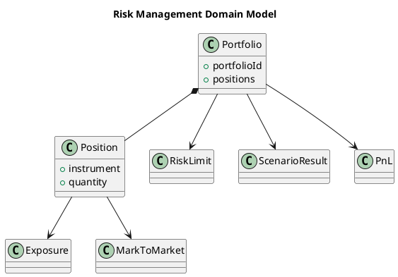
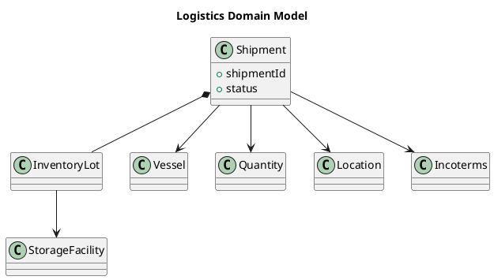
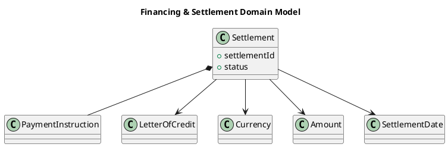
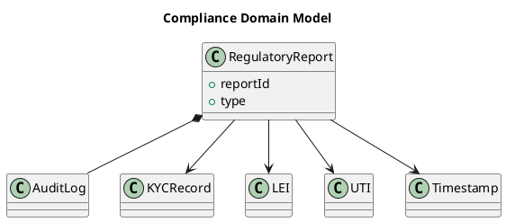
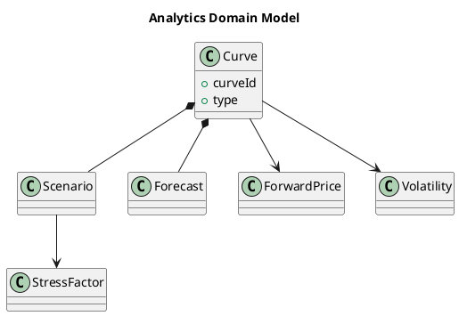

# Tactical DDD for Commodities Trading domain

Diving into the strategic **bounded contexts**, let's visit **aggregates, entities, value objects, domain services, repositories, factories, and domain events**.

## Aggregates & Aggregate Roots

Aggregates are **consistency boundaries**. In commodities trading, they ensure that invariants hold across related objects.

### Trade Capture Context

```plantuml
title Trade Capture Domain Model

class Trade {
  +tradeId
  +instrument
  +price
  +quantity
  +status
}

class TradeLine
class Counterparty {
  +counterpartyId
  +name
}
class Contract

class Price
class Quantity
class TradeDate
class InstrumentId

Trade *-- TradeLine
Trade --> Counterparty
Trade --> Contract
Trade --> Price
Trade --> Quantity
Trade --> TradeDate
Trade --> InstrumentId

```

* **Aggregate Root**: `Trade`
* **Entities**: `TradeLine`, `Counterparty`, `Contract`
* **Value Objects**: `Price`, `Quantity`, `InstrumentId`, `TradeDate`
* **Invariants**:

  * Trade must have a counterparty.
  * Trade quantity > 0.
  * Status transitions follow rules (Captured → Confirmed → Settled).

### Risk Management Context



* **Aggregate Root**: `Portfolio`
* **Entities**: `Position`, `Exposure`, `RiskLimit`
* **Value Objects**: `MarkToMarket`, `ScenarioResult`, `PnL`
* **Invariants**:

  * Portfolio exposure must not exceed assigned `RiskLimit`.
  * Position is derived only from valid trades.

### Logistics Context



* **Aggregate Root**: `Shipment`
* **Entities**: `InventoryLot`, `Vessel`, `StorageFacility`
* **Value Objects**: `Quantity`, `Location`, `Incoterms`
* **Invariants**:

  * Shipment quantity cannot exceed available inventory.
  * Delivery must match trade Incoterms.

### Financing & Settlement Context



* **Aggregate Root**: `Settlement`
* **Entities**: `PaymentInstruction`, `LetterOfCredit`
* **Value Objects**: `Currency`, `Amount`, `SettlementDate`
* **Invariants**:

  * Payment must not be executed if LC is expired.
  * Settlement links back to confirmed trade.

### Compliance Context



* **Aggregate Root**: `RegulatoryReport`
* **Entities**: `AuditLog`, `KYCRecord`
* **Value Objects**: `LEI`, `UTI`, `Timestamp`
* **Invariants**:

  * All reported trades must contain mandatory identifiers (LEI, UTI).
  * Audit log must be immutable.

### Analytics Context



* **Aggregate Root**: `Curve`
* **Entities**: `Scenario`, `Forecast`
* **Value Objects**: `ForwardPrice`, `Volatility`, `StressFactor`
* **Invariants**:

  * Curve must be generated from validated market data.

## Entities vs. Value Objects

* **Entities (identity, lifecycle)**: `Trade`, `Position`, `Shipment`, `Settlement`, `Counterparty`.
* **Value Objects (immutable, equality by value)**: `Price`, `Quantity`, `Currency`, `TradeDate`, `Incoterms`.

## Domain Services

Domain services hold logic that doesn’t naturally belong to a single entity.

* `TradeValidationService`: ensures compliance with market rules before capture.
* `RiskCalculationService`: computes VaR, exposures, stress scenarios.
* `LogisticsSchedulingService`: allocates shipments to vessels.
* `SettlementProcessingService`: orchestrates payment with bank.
* `RegulatoryReportingService`: generates EMIR/MiFID/REMIT reports.

## Repositories

Repositories abstract persistence, exposing aggregates in domain terms.

* `TradeRepository` → find trade by ID, list open trades.
* `PortfolioRepository` → get positions by portfolio.
* `ShipmentRepository` → query inventory lots.
* `SettlementRepository` → retrieve settlement instructions.

## Factories

Factories encapsulate complex creation logic.

* `TradeFactory`: builds trade aggregate from incoming FIX message.
* `PortfolioFactory`: constructs initial portfolio from historical trades.
* `ShipmentFactory`: creates shipment from trade Incoterms.

## Domain Events

Events capture important state changes and are key for **event-driven architecture**.

* `TradeCaptured`
* `TradeConfirmed`
* `TradeAmended`
* `PositionUpdated`
* `LimitBreached`
* `ShipmentScheduled`
* `ShipmentDelivered`
* `PaymentSettled`
* `LCExpired`
* `ReportGenerated`
* `KYCFlagged`

## Application Services

These orchestrate **use cases**, invoking aggregates, repositories, and services.

* `CaptureTradeAppService`
* `RunRiskAssessmentAppService`
* `ScheduleShipmentAppService`
* `ProcessSettlementAppService`
* `GenerateComplianceReportAppService`

## Anti-Corruption Layers

Since commodities trading systems integrate with **exchanges, banks, market data providers**, ACLs protect the domain model from polluted external models.

* FIX/FPML adapter for trade ingestion.
* SWIFT/ISO20022 adapter for settlements.
* Market data adapter for Bloomberg/Platts feeds.

## Summary

Tactical DDD in commodities trading means:

* **Aggregates** for strong consistency boundaries (`Trade`, `Portfolio`, `Shipment`, `Settlement`).
* **Entities** for identity and lifecycle (`Counterparty`, `Position`).
* **Value Objects** for immutable, domain-specific values (`Price`, `Quantity`, `Currency`).
* **Domain Events** for real-time reactions (`TradeCaptured`, `PaymentSettled`).
* **Domain Services, Repositories, Factories** to handle logic, persistence, and creation.
