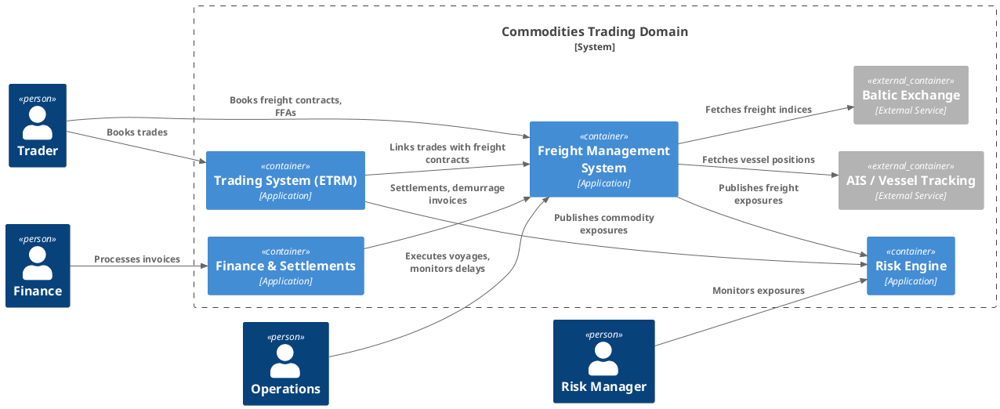
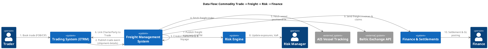

# Freight in Commodities Trading


## C4 Container View




## Deployment View

```plantuml
@startuml
!include <C4/C4_Deployment>

Deployment_Node(cloud, "Cloud Platform", "AWS/Azure") {
  Deployment_Node(appTier, "Application Tier", "Kubernetes Cluster") {
    ContainerInstance(tradingSvc, "Trading System (ETRM)", "Service")
    ContainerInstance(freightSvc, "Freight Management", "Service")
    ContainerInstance(riskSvc, "Risk Engine", "Service")
    ContainerInstance(financeSvc, "Finance & Settlements", "Service")
  }
  Deployment_Node(dataTier, "Databases", "Managed SQL + NoSQL") {
    ContainerInstance(tradingDb, "Trading DB", "Relational DB")
    ContainerInstance(freightDb, "Freight DB", "Relational DB")
    ContainerInstance(riskDb, "Risk DB", "Time-Series DB")
    ContainerInstance(financeDb, "Finance DB", "Relational DB")
  }
  Deployment_Node(integration, "Integration Layer", "Kafka / APIs") {
    ContainerInstance(eventBus, "Event Bus", "Kafka/MQ")
    ContainerInstance(apiGw, "API Gateway", "REST/GraphQL")
  }
}

Deployment_Node(external, "External Providers", "Internet") {
  ContainerInstance(baltic, "Baltic Exchange API", "External")
  ContainerInstance(ais, "AIS Vessel Tracking", "External")
}
@enduml
```


## Data Flow View




## Conclusion

Freight is both an **operational** and **financial** domain in commodities trading.  
It requires tight **integration with Trading, Risk, and Finance**, real-time **data feeds** (AIS, Baltic Exchange), and strong **event-driven architecture** for accurate PnL and exposure management.
