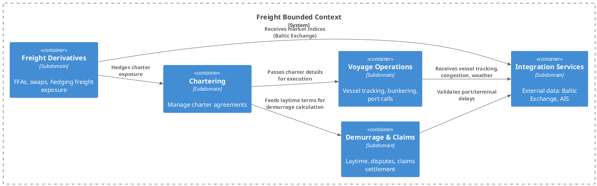
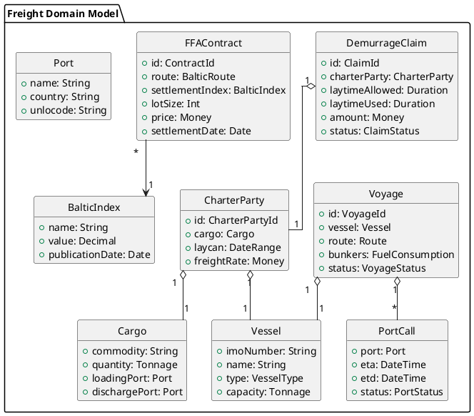

# DDD for Freight domain

## Bounded Contexts (DDD Strategic View)

Freight is its own **bounded context** with links to:  
- **Trading** (freight cost part of landed price, arbitrage)  
- **Risk Management** (hedging freight exposure with FFAs)  
- **Operations** (scheduling, demurrage, voyage execution)  
- **Finance** (settlements, invoices, claims)  

```plantuml
@startuml
!include <C4/C4_Context>

LAYOUT_LEFT_RIGHT()

Person(trader, "Trader", "Executes commodity and freight trades")
Person(ops, "Operations", "Manages logistics, shipping, demurrage")
Person(risk, "Risk Manager", "Hedges freight exposure, monitors PnL")

System_Boundary(domain, "Commodities Trading Domain") {
  System_BC(trading, "Trading", "Capture commodity trades, link to freight")
  System_BC(freight, "Freight", "Chartering, freight contracts, FFA hedging, demurrage")
  System_BC(riskmgt, "Risk Management", "Market risk, freight exposure, FFA hedges")
  System_BC(opsbc, "Operations", "Vessel tracking, scheduling, port operations")
  System_BC(finance, "Finance", "Freight settlements, invoices, claims")
}

Rel(trader, trading, "Executes trades")
Rel(trader, freight, "Negotiates freight deals")
Rel(ops, freight, "Manages chartering, voyage execution")
Rel(risk, riskmgt, "Monitors freight risk")

Rel(trading, freight, "Links commodity trades with freight costs")
Rel(freight, riskmgt, "Exposes freight positions, FFA hedges")
Rel(freight, opsbc, "Shares vessel schedules, demurrage data")
Rel(freight, finance, "Invoices, settlements, claims")
@enduml
```


## Freight Internal Subdomains (DDD Tactical View)

- **Chartering** (voyage/time charters, CoAs)  
- **Freight Derivatives** (FFAs, swaps, hedging)  
- **Demurrage & Claims** (laytime disputes, penalties)  
- **Voyage Operations** (vessel tracking, bunkering, port calls)  
- **Integration Services** (Baltic Exchange, AIS, weather)  




## Domain Model (Entities & Aggregates)

Key aggregates:  
- **CharterParty**, **Voyage**, **DemurrageClaim**, **FFAContract**  
Supporting entities: **Vessel, Cargo, Port, PortCall, BalticIndex**  




## Cross-Context Relationships

```plantuml
@startuml
hide circle
hide methods
skinparam linetype ortho

package "Trading BC" {
  class CommodityTrade {
    +id: TradeId
    +commodity: String
    +quantity: Tonnage
    +price: Money
    +incoterm: Incoterm
    +status: TradeStatus
  }
  class TradeShipment {
    +id: ShipmentId
    +linkedTrade: CommodityTrade
    +freight: CharterParty
  }
}

package "Freight BC" {
  class CharterParty { +id: CharterPartyId }
  class Voyage { +id: VoyageId }
  class DemurrageClaim { +id: ClaimId }
  class FFAContract { +id: ContractId }
}

package "Risk BC" {
  class MarketExposure { +id: ExposureId }
  class FreightExposure { +id: ExposureId }
  class Hedge { +id: HedgeId }
}

CommodityTrade "1" --> "0..*" TradeShipment
TradeShipment "1" --> "1" CharterParty : "uses"
Voyage "1" o-- "1" CharterParty
DemurrageClaim "0..*" --> "1" CharterParty
FFAContract --> FreightExposure : "creates MTM exposure"
FreightExposure --> Hedge : "is hedged by"
MarketExposure --> Hedge : "is hedged by"
@enduml
```
